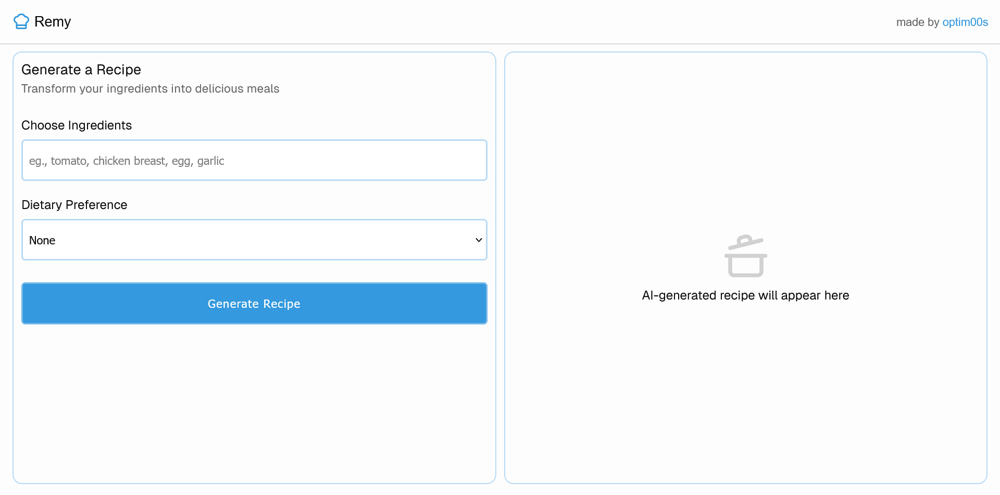

# Remy 
Remy is a web application that allows users to generate recipes based on their chosen ingredients and dietary preferences. Powered by OpenRouter (using the `qwen/qwen3-8b-04-28:free` model)

## Gallery


## Features
- **Recipe Generation**: Enter ingredients and select a dietary preference to generate a custom recipe.
- **Dietary Preferences**: Supports options like Vegan, Vegetarian, Gluten-Free, Dairy-Free, or None.
- **User-Friendly Interface**: Clean and responsive design with a loading state and error handling.
- **AI-Powered**: Leverages OpenRouter's API to generate practical and yummy recipes.

## Tech Stack
- [Next.js](https://nextjs.org/)
- [TypeScript](https://www.typescriptlang.org/)
- [Sass](https://sass-lang.com/)
- [Lucide React](https://lucide.dev/) - for icons
- [OpenRouter](https://openrouter.ai/) - for AI model API (using `qwen/qwen3-8b-04-28:free`)

## Getting Started

1. Clone the repository
   ```
   git clone https://github.com/optim00s/remy
   ``` 
2. Install dependencies:
   ```bash
   npm install
   ```
3. Create a `.env.local` file in the root directory and add your OpenRouter API key:
   ```
   OPENROUTER_API_KEY=your_api_key_here
   ```
4. Run the development server:
   ```bash
   npm run dev
   ```
5. Open [http://localhost:3000](http://localhost:3000) in your browser

## Environment Variables
- `OPENROUTER_API_KEY` - Your OpenRouter API key (required)

## Future Enhancements
- **Recipe History**: Save and access previously generated recipes
- **User Accounts**: Personal recipe collections and preferences
- **Multiple AI Models**: Choose from different AI models for recipe generation
